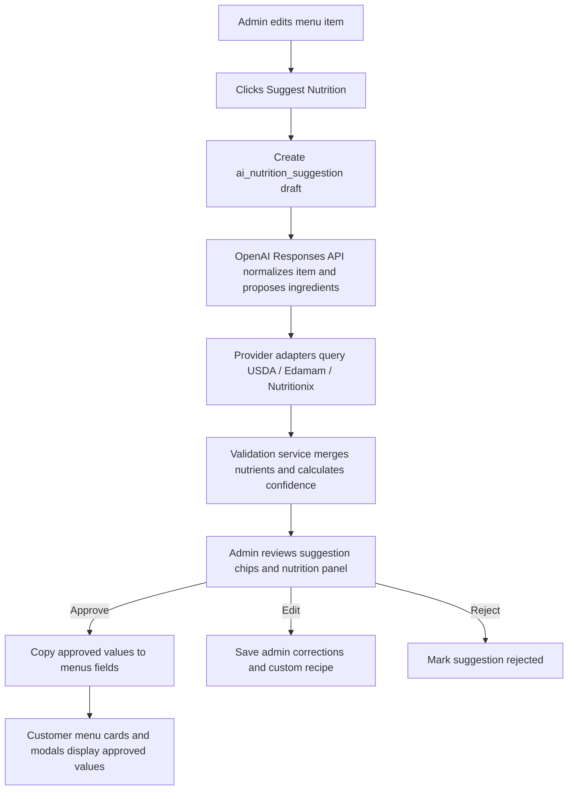

# AI Nutrition Suggestions System Plan

## Purpose

Restaurant admins need a reviewable assistant that can turn a menu item name, description, and optional ingredient notes into suggested ingredients and estimated nutrition values. The system must never publish AI estimates automatically. It should store suggestions separately, show confidence/source details to the admin, and copy approved values into the menu item fields that the customer frontend already renders.

## Current food-item fields

Menu items already expose customer-safe dietary flags, allergens, and nutrition display fields:

- `is_halal`, `is_vegetarian`, `is_vegan`
- allergen relation data exposed as `allergens` and `allergy_tags`
- `calories`, `protein`, `carbs`, `fat`, `sugar`, `serving_size`
- `color` for an optional compact menu color badge

The AI system should treat those as approved menu-item facts. Draft AI output should live in separate suggestion tables until an admin reviews and approves it.

## External services and source strategy

### OpenAI Responses API with Structured Outputs

Use the OpenAI Responses API for language normalization, multilingual ingredient extraction, ambiguity handling, and explanation generation. The current OpenAI API docs describe the Responses endpoint as the primary interface for model responses, with structured JSON configured through `text.format` using a `json_schema`. Structured Outputs are preferred over JSON mode because they enforce schema adherence, and `strict: true` can require supported JSON Schema fields to match exactly.

Recommended usage:

1. Send restaurant/menu context, tenant locale, item name, description, and admin-provided ingredient hints.
2. Request a strict JSON object with ingredients, estimated serving size, calories/macros, uncertainty, dietary warnings, and questions for the admin.
3. Never ask the model to be the source of truth for nutrition. Ask it to normalize the item and propose likely ingredients/portions that can be validated by nutrition databases.

### Nutrition databases

Use a provider adapter layer so each tenant can use the best available source without coupling admin UI to one vendor.

| Provider | Best use | Notes |
| --- | --- | --- |
| USDA FoodData Central | Public reference data and source IDs for raw/common foods | USDA documents Food Search and Food Details endpoints and requires a data.gov API key. Store FDC IDs and nutrient IDs for traceability. |
| Edamam Nutrition Analysis | Recipe/ingredient-line NLP and multilingual workflows | Edamam documents recipe/text nutrition analysis, food/quantity extraction, health/diet/allergy labels, multilingual support, and possible caching limits by plan. |
| Nutritionix | Branded/common restaurant-style foods and natural language queries | Use as a paid/commercial fallback where restaurant/menu items are better represented than USDA raw ingredients. Confirm plan terms before caching. |

## High-level flow



## Proposed schema

### `ai_nutrition_suggestions`

Stores one AI/provider run per menu item and tenant.

```sql
CREATE TABLE ai_nutrition_suggestions (
  suggestion_id BIGINT UNSIGNED AUTO_INCREMENT PRIMARY KEY,
  menu_id BIGINT UNSIGNED NOT NULL,
  tenant_id BIGINT UNSIGNED NULL,
  locale VARCHAR(12) NOT NULL DEFAULT 'en',
  input_name VARCHAR(255) NOT NULL,
  input_description TEXT NULL,
  input_ingredients TEXT NULL,
  normalized_name VARCHAR(255) NULL,
  serving_size VARCHAR(64) NULL,
  calories INT UNSIGNED NULL,
  protein DECIMAL(8,2) NULL,
  carbs DECIMAL(8,2) NULL,
  fat DECIMAL(8,2) NULL,
  sugar DECIMAL(8,2) NULL,
  confidence_score DECIMAL(4,3) NOT NULL DEFAULT 0,
  status ENUM('draft','needs_review','approved','rejected','superseded') NOT NULL DEFAULT 'draft',
  model VARCHAR(80) NULL,
  provider_summary JSON NULL,
  validation_warnings JSON NULL,
  admin_notes TEXT NULL,
  approved_by BIGINT UNSIGNED NULL,
  approved_at TIMESTAMP NULL,
  created_at TIMESTAMP NULL,
  updated_at TIMESTAMP NULL,
  INDEX idx_ai_nutrition_menu_status (menu_id, status)
);
```

### `ai_nutrition_suggestion_ingredients`

Stores ingredient chips shown below the admin description/ingredient fields.

```sql
CREATE TABLE ai_nutrition_suggestion_ingredients (
  ingredient_id BIGINT UNSIGNED AUTO_INCREMENT PRIMARY KEY,
  suggestion_id BIGINT UNSIGNED NOT NULL,
  name VARCHAR(160) NOT NULL,
  original_text VARCHAR(255) NULL,
  quantity DECIMAL(10,3) NULL,
  unit VARCHAR(40) NULL,
  grams DECIMAL(10,2) NULL,
  calories INT UNSIGNED NULL,
  protein DECIMAL(8,2) NULL,
  carbs DECIMAL(8,2) NULL,
  fat DECIMAL(8,2) NULL,
  sugar DECIMAL(8,2) NULL,
  source_provider VARCHAR(40) NULL,
  source_food_id VARCHAR(80) NULL,
  confidence_score DECIMAL(4,3) NOT NULL DEFAULT 0,
  selected_by_admin BOOLEAN NOT NULL DEFAULT FALSE,
  created_at TIMESTAMP NULL,
  updated_at TIMESTAMP NULL
);
```

### `menu_nutrition_overrides`

Optional restaurant-specific recipe memory. If a tenant always prepares “Chicken Pasta” a certain way, use this before generic database lookup.

```sql
CREATE TABLE menu_nutrition_overrides (
  override_id BIGINT UNSIGNED AUTO_INCREMENT PRIMARY KEY,
  menu_id BIGINT UNSIGNED NULL,
  tenant_id BIGINT UNSIGNED NULL,
  canonical_name VARCHAR(255) NOT NULL,
  locale VARCHAR(12) NOT NULL DEFAULT 'en',
  ingredients JSON NOT NULL,
  nutrition JSON NOT NULL,
  source ENUM('admin','import','approved_ai') NOT NULL DEFAULT 'admin',
  created_by BIGINT UNSIGNED NULL,
  created_at TIMESTAMP NULL,
  updated_at TIMESTAMP NULL,
  INDEX idx_menu_nutrition_override_lookup (tenant_id, canonical_name, locale)
);
```

## API design

### `POST /admin/api/menus/{menu}/nutrition-suggestions`

Creates a suggestion draft.

Request:

```json
{
  "locale": "en",
  "name": "Chicken shawarma wrap",
  "description": "Grilled chicken, garlic sauce, pickles, fries",
  "ingredient_hints": ["chicken", "garlic sauce", "flatbread"],
  "serving_size": "1 wrap"
}
```

Response:

```json
{
  "success": true,
  "data": {
    "suggestion_id": 123,
    "status": "needs_review",
    "ingredients": [
      { "name": "grilled chicken", "quantity": 120, "unit": "g", "confidence_score": 0.84 },
      { "name": "flatbread", "quantity": 1, "unit": "piece", "confidence_score": 0.72 }
    ],
    "nutrition": {
      "calories": 620,
      "protein": 34.5,
      "carbs": 58.0,
      "fat": 24.0,
      "sugar": 4.8,
      "serving_size": "1 wrap"
    },
    "warnings": ["Estimate only; verify sauce quantity."],
    "disclaimer": "AI-assisted estimate. Admin approval required before display."
  }
}
```

### `PATCH /admin/api/menus/{menu}/nutrition-suggestions/{suggestion}`

Allows admin edits, ingredient chip selection, and rejection notes.

### `POST /admin/api/menus/{menu}/nutrition-suggestions/{suggestion}/approve`

Copies approved values to `menus.calories`, `menus.protein`, `menus.carbs`, `menus.fat`, `menus.sugar`, and `menus.serving_size`. It can also update allergens/dietary tags only if the admin explicitly checks those fields.

## Structured Output schema for OpenAI

Use a strict schema similar to:

```json
{
  "type": "json_schema",
  "name": "menu_nutrition_suggestion",
  "strict": true,
  "schema": {
    "type": "object",
    "additionalProperties": false,
    "required": ["normalized_name", "locale", "ingredients", "nutrition", "confidence_score", "warnings", "admin_questions"],
    "properties": {
      "normalized_name": { "type": "string" },
      "locale": { "type": "string" },
      "ingredients": {
        "type": "array",
        "items": {
          "type": "object",
          "additionalProperties": false,
          "required": ["name", "quantity", "unit", "grams", "confidence_score"],
          "properties": {
            "name": { "type": "string" },
            "quantity": { "type": ["number", "null"] },
            "unit": { "type": ["string", "null"] },
            "grams": { "type": ["number", "null"] },
            "confidence_score": { "type": "number", "minimum": 0, "maximum": 1 }
          }
        }
      },
      "nutrition": {
        "type": "object",
        "additionalProperties": false,
        "required": ["calories", "protein", "carbs", "fat", "sugar", "serving_size"],
        "properties": {
          "calories": { "type": ["integer", "null"] },
          "protein": { "type": ["number", "null"] },
          "carbs": { "type": ["number", "null"] },
          "fat": { "type": ["number", "null"] },
          "sugar": { "type": ["number", "null"] },
          "serving_size": { "type": ["string", "null"] }
        }
      },
      "confidence_score": { "type": "number", "minimum": 0, "maximum": 1 },
      "warnings": { "type": "array", "items": { "type": "string" } },
      "admin_questions": { "type": "array", "items": { "type": "string" } }
    }
  }
}
```

## Admin UI behavior

- Add a **Suggest nutrition** button next to the menu name/description/ingredient fields.
- Show ingredient suggestions as selectable chips under the description/ingredient field.
- Allow one-click insertion of chips into the ingredient field.
- Show a review panel with calories/macros, confidence, provider source IDs, warnings, and the required disclaimer.
- Require explicit **Approve and publish** before copying values into the menu item.
- Keep rejected suggestions for audit and provider tuning, but never expose them to guests.

## Customer frontend behavior

- Menu cards: show compact circular food attribute icons, optional color dot, and compact calories.
- Detail modal: show expanded icon + label food attribute pills, optional color dot, and full nutrition summary.
- If no approved nutrition exists, show nothing rather than an AI placeholder.
- Include the disclaimer in detailed nutrition views when nutrition data is present.

## Validation and safety rules

1. Validate schema server-side even with Structured Outputs enabled.
2. Reject impossible values: negative nutrients, extreme calories, macros grossly inconsistent with calories, or missing serving size when calories are present.
3. Store source provider IDs and confidence, not just final numbers.
4. Keep tenant data isolated by tenant connection/tenant ID.
5. Never provide medical advice; use an estimate disclaimer.
6. Do not auto-set allergens from AI. Offer warnings for admin review only.
7. Respect provider licensing and caching terms, especially for paid nutrition databases.

## Implementation phases

1. **Schema and services**: migrations, provider adapter interfaces, OpenAI client service, validation service.
2. **Admin draft UI**: Suggest button, ingredient chips, review/approve/reject actions.
3. **Approval publishing**: copy approved values into `menus` fields; audit approver/time.
4. **Frontend display**: read only approved menu fields already returned by API.
5. **Evaluation**: compare suggestions to manually entered recipes; track admin edits and rejection reasons.

## Server rollout

```bash
php artisan migrate
php artisan config:clear
php artisan cache:clear
php artisan route:clear
php artisan view:clear
```

For the frontend:

```bash
cd frontend
npm install
npm run build
```
