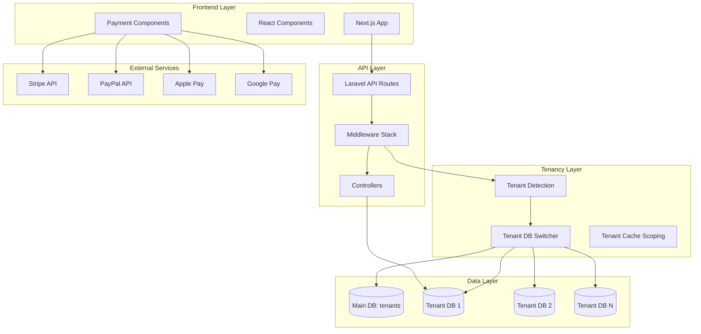

# PayMyDine Architecture

**Last Updated:** 2025-10-09  
**Version:** 1.0  

---

## Executive Summary

PayMyDine is a multi-tenant restaurant ordering system consisting of:
- **Backend**: Laravel 7.x + TastyIgniter (PHP 7.4+)
- **Frontend**: Next.js 14 (TypeScript, React 18)
- **Database**: MySQL 8.0 (multi-tenant architecture)
- **Payments**: Stripe, PayPal, Apple Pay, Google Pay
- **Deployment**: Mixed (traditional PHP + Node.js)

---

## System Overview



---

## Request Flow

### 1. Tenant Detection & Routing

**Evidence:** `app/Http/Middleware/DetectTenant.php:20-78`, `app/Http/Middleware/TenantDatabaseMiddleware.php:12-63`

```
1. HTTP Request arrives (e.g., https://rosana.paymydine.com/api/v1/menu)
2. DetectTenant middleware extracts subdomain "rosana"
3. Query main DB (mysql connection) for tenant:
   SELECT * FROM ti_tenants WHERE domain LIKE 'rosana.%' OR domain = 'rosana'
4. If found:
   - Configure tenant connection with tenant's database credentials
   - Purge and reconnect 'tenant' connection
   - Set default connection to 'tenant'
   - Store tenant object in request attributes and app container
5. If not found:
   - Return 404 "Tenant not found"
6. Proceed to controller with tenant-scoped DB
```

**Critical Files:**
- `app/Http/Middleware/DetectTenant.php`
- `app/Http/Middleware/TenantDatabaseMiddleware.php`
- `app/Http/Kernel.php:27-28` (middleware registration)
- `config/database.php:63-81` (tenant connection config)

---

### 2. API Request Flow

**Evidence:** `routes/api.php:122-408`, `routes.php:359-917`

```
Client → CORS Middleware → Tenant Detection → Controller → Database → Response
```

**Key Middleware Stack:**
1. `cors` - CORS headers (all origins allowed in dev - **SECURITY ISSUE**)
2. `detect.tenant` - Tenant detection and DB switching
3. Route-specific validation (inline in controllers)

---

## Multi-Tenancy Architecture

### Tenant Detection Mechanism

**Evidence:** `app/Http/Middleware/DetectTenant.php:87-109`

```php
private function extractSubdomainFromHost($host)
{
    $parts = explode('.', $host);
    
    // If we have at least 3 parts (subdomain.domain.tld), return the first part
    if (count($parts) >= 3) {
        return $parts[0];
    }
    
    // If we have 2 parts, check if it's not the main domain
    if (count($parts) === 2) {
        $mainDomains = ['paymydine.com', 'localhost'];
        if (!in_array($host, $mainDomains)) {
            return $parts[0];
        }
    }
    
    return null;
}
```

**Tenant Sources:**
1. **Primary**: Subdomain from Host header
2. **Fallback**: `X-Tenant-Subdomain` header
3. **Fallback**: `X-Original-Host` header (for proxies)

### Database Switching

**Evidence:** `app/Http/Middleware/DetectTenant.php:35-49`

```php
// Configure tenant connection
Config::set('database.connections.tenant.database', $tenant->database);
Config::set('database.connections.tenant.host', $tenant->db_host ?? env('TENANT_DB_HOST'));
Config::set('database.connections.tenant.port', $tenant->db_port ?? env('TENANT_DB_PORT'));
Config::set('database.connections.tenant.username', $tenant->db_user ?? env('TENANT_DB_USERNAME'));
Config::set('database.connections.tenant.password', $tenant->db_pass ?? env('TENANT_DB_PASSWORD'));

// Reconnect to tenant database
DB::purge('tenant');
DB::reconnect('tenant');

// Set tenant as default connection
Config::set('database.default', 'tenant');
DB::setDefaultConnection('tenant');
```

### Tenant Data Model

**Evidence:** Main DB table `ti_tenants` (inferred from middleware queries)

```sql
CREATE TABLE ti_tenants (
    id INT PRIMARY KEY AUTO_INCREMENT,
    domain VARCHAR(255) NOT NULL UNIQUE,
    database VARCHAR(255) NOT NULL,
    db_host VARCHAR(255),
    db_port INT,
    db_user VARCHAR(255),
    db_pass VARCHAR(255),
    status ENUM('active', 'disabled') DEFAULT 'active',
    created_at TIMESTAMP,
    updated_at TIMESTAMP,
    INDEX idx_domain (domain),
    INDEX idx_status (status)
);
```

---

## Core Modules

### 1. Menu Module

**Controllers:** `app/Http/Controllers/Api/MenuController.php`

**Endpoints:**
- `GET /api/v1/menu` - Full menu with categories
- `GET /api/v1/menu/items` - Flat list of items
- `GET /api/v1/menu/categories/{categoryId}/items` - Items by category
- `GET /api/v1/table-menu?table_id=X` - Table-specific menu

**Key Features:**
- Menu items with options (sizes, toppings, etc.)
- Category management
- Image handling via hashed paths
- Stock tracking

**Evidence:** `app/Http/Controllers/Api/MenuController.php:14-322`

---

### 2. Order Module

**Controllers:** `app/Http/Controllers/Api/OrderController.php`

**Endpoints:**
- `POST /api/v1/orders` - Create order
- `GET /api/v1/orders/{orderId}` - Get order details
- `PATCH /api/v1/orders/{orderId}` - Update order status
- `GET /api/v1/orders` - List orders (paginated)
- `GET /api/v1/order-status?order_id=X` - Get order status
- `POST /api/v1/order-status` - Update order status

**Order Lifecycle:**
1. **Create** (status_id=1, pending)
2. **Confirmed** (status_id=2)
3. **Preparing** (status_id=3)
4. **Ready** (status_id=4)
5. **Delivered** (status_id=5)
6. **Cancelled** (status_id=6)

**Evidence:** `app/Http/Controllers/Api/OrderController.php:16-437`

**⚠️ CRITICAL ISSUES:**
- **Line 333**: `$number = DB::table('orders')->max('order_id') + 1;` - **Race condition!** Use DB sequence or UUID
- **Line 50**: Transaction used but no FK enforcement means orphaned records possible
- No tenant scoping validation - relies on middleware DB switch

---

### 3. Table Module

**Controllers:** `app/Http/Controllers/Api/TableController.php`

**Endpoints:**
- `GET /api/v1/tables` - List all tables
- `GET /api/v1/tables/{qrCode}` - Get table by QR code
- `GET /api/v1/table-info?table_id=X` - Get table info

**QR Code Flow:**
1. Customer scans QR code (e.g., `table-5` or `cashier`)
2. QR redirect (`/redirect/qr?code=X`) resolves table
3. Frontend navigates to `/table/{table_id}/menu`
4. API requests include `table_id` in payload

**Evidence:** `app/Http/Controllers/Api/TableController.php:14-204`

---

### 4. Notification Module

**Helpers:** `app/Helpers/NotificationHelper.php`

**Notification Types:**
- `waiter_call` - Customer requests waiter
- `valet_request` - Customer requests valet
- `table_note` - Customer leaves note
- `order_status` - Order status changes

**Features:**
- Duplicate prevention (60-second window)
- Rate limiting (5 notifications/table/hour)
- Tenant-scoped cache keys

**Evidence:** `app/Helpers/NotificationHelper.php:17-304`

---

### 5. Payment Module

**Frontend:** `frontend/lib/payment-service.ts`, `frontend/app/api/payments/`

**Supported Methods:**
- **Stripe** (Visa, Mastercard, Amex)
- **PayPal**
- **Apple Pay**
- **Google Pay**
- **Cash**

**Payment Flow:**
1. Customer selects payment method
2. Frontend creates payment intent via `/api/payments/create-intent`
3. Stripe/PayPal SDK handles card collection (PCI compliant)
4. Backend confirms payment and updates order
5. Notification sent to restaurant

**Marketplace Architecture:**
- Platform takes 3% fee (`amount * 0.03`)
- Funds transferred to restaurant's Stripe Connect account
- Each tenant needs a Stripe Connect account

**Evidence:** 
- `frontend/lib/payment-service.ts:96-475`
- `frontend/app/api/payments/create-intent/route.ts:12-96`

**⚠️ SECURITY ISSUES:**
- No webhook signature verification found
- No idempotency keys for payment intents
- Missing webhook handler for `payment_intent.succeeded`
- Hardcoded platform fee (should be configurable)

---

## Dangerous Edges (Security & Tenancy Risks)

### 🔴 CRITICAL

1. **Tenant Isolation Bypass Routes**
   - **Evidence:** `routes.php:225-260` - Superadmin routes bypass `TenantDatabaseMiddleware`
   - **Risk:** Cross-tenant data leakage if authentication fails
   - **Routes:**
     - `/new/store` - Create tenant
     - `/tenants/update` - Update tenant
     - `/tenants/delete/{id}` - Delete tenant
     - `/tenant/update-status` - Activate/deactivate tenant
   - **Mitigation:** Add superadmin authentication middleware (exists but need to verify enforcement)

2. **Order ID Race Condition**
   - **Evidence:** `app/Http/Controllers/Api/OrderController.php:333`
   - **Code:** `$number = DB::table('orders')->max('order_id') + 1;`
   - **Risk:** Duplicate order IDs under concurrent requests
   - **Impact:** Order overwrites, data corruption
   - **Fix:** Use database AUTO_INCREMENT or UUID

3. **CORS Wildcard in Production**
   - **Evidence:** `app/Http/Middleware/CorsMiddleware.php:22`
   - **Code:** `$response->headers->set('Access-Control-Allow-Origin', '*');`
   - **Risk:** Any domain can call API, CSRF attacks
   - **Fix:** Restrict to frontend domain(s)

4. **No CSRF Protection**
   - **Evidence:** No CSRF token validation in `routes/api.php` or middleware
   - **Risk:** State-changing requests (POST, DELETE) vulnerable to CSRF
   - **Fix:** Enable Laravel CSRF middleware for session-based routes

5. **Missing Rate Limiting**
   - **Evidence:** No `throttle` middleware in `routes/api.php:122-408`
   - **Risk:** DDoS, brute force attacks, API abuse
   - **Fix:** Add throttle middleware (60 requests/minute per IP)

---

### 🟠 HIGH

6. **Tenant Detection Bypass via Headers**
   - **Evidence:** `app/Http/Middleware/DetectTenant.php:22-25`
   - **Code:** `$subdomain = $request->header('X-Tenant-Subdomain') ?? ...`
   - **Risk:** Client can fake tenant via header manipulation
   - **Fix:** Only trust Host header, validate against allowed domains

7. **No Foreign Key Constraints**
   - **Evidence:** `db/schema.sql` (sample shows no FKs)
   - **Risk:** Orphaned records (orders without menus, etc.)
   - **Fix:** Add FK migrations (see DATA_MODEL.md)

8. **Hardcoded Credentials in Config**
   - **Evidence:** `config/database.php:51-52`
   - **Code:** `'password' => env('DB_PASSWORD', 'P@ssw0rd@123'),`
   - **Risk:** Default password in source code
   - **Fix:** Require env var, fail if not set

9. **Payment Intent Without Idempotency**
   - **Evidence:** `frontend/app/api/payments/create-intent/route.ts:52`
   - **Risk:** Duplicate charges if client retries
   - **Fix:** Add `idempotency_key` parameter

---

### 🟡 MEDIUM

10. **SQL Injection via Raw Queries**
    - **Evidence:** `app/Http/Controllers/Api/MenuController.php:18-34`
    - **Code:** Raw SQL queries without prepared statements (actually uses `DB::select($query)` which is safe)
    - **Risk:** Minimal (Laravel escapes by default), but should use query builder
    - **Fix:** Replace raw SQL with Eloquent or query builder

11. **Missing Input Validation**
    - **Evidence:** `routes.php:580-718` - Inline validation only
    - **Risk:** Malformed data, SQL injection attempts
    - **Fix:** Use Laravel Form Requests for all write endpoints

12. **No Pagination Defaults**
    - **Evidence:** `app/Http/Controllers/Api/MenuController.php:14-77` - No limit on menu items
    - **Risk:** Memory exhaustion, slow responses
    - **Fix:** Add pagination (20-100 items per page)

13. **Weak Password Hashing**
    - **Evidence:** No password handling code found in API controllers
    - **Assumption:** TastyIgniter handles this, but not verified
    - **Fix:** Verify bcrypt/argon2 is used

---

### 🟢 LOW

14. **Debug Endpoint in Production**
    - **Evidence:** `routes/api.php:137-149` - `/debug/conn` endpoint
    - **Risk:** Information disclosure (DB names, connections)
    - **Fix:** Already gated by `config('app.debug')`, ensure debug=false in production

15. **Verbose Error Messages**
    - **Evidence:** `app/Http/Controllers/Api/OrderController.php:161`
    - **Code:** `'message' => $e->getMessage()`
    - **Risk:** Stack traces leak file paths, DB schema
    - **Fix:** Log errors, return generic messages in production

---

## Authentication & Authorization

### Current State

**Evidence:** No explicit authentication found in API routes

**Observations:**
- API routes in `routes/api.php:122-408` have **no authentication middleware**
- Admin routes use `'middleware' => ['web', 'AdminAuthenticate']` (`routes.php:922-927`)
- Superadmin routes use `'middleware' => 'superadmin.auth'` (`routes.php:210-248`)

**⚠️ CRITICAL ISSUE:** Public API endpoints have **no authentication**:
- Anyone can create orders, access menus, view tables
- Relies on tenancy for isolation, but no user identity
- No way to prevent abuse or track customers

**Recommended:**
1. Implement JWT or session-based auth for customers
2. Add API key authentication for mobile apps
3. Role-based access control (customer, waiter, manager, admin)

---

### Session & Cookies

**Evidence:** `config/session.php` (not read, but Laravel default is sessions via cookies)

**Assumptions:**
- Laravel uses encrypted session cookies
- Default: `SESSION_DRIVER=file` (not suitable for multi-tenant)

**⚠️ ISSUES:**
- No `Secure` flag enforced (HTTP allowed)
- No `HttpOnly` flag (vulnerable to XSS)
- No `SameSite=Strict` (CSRF risk)

**Fix:** See SECURITY_THREAT_MODEL.md for cookie hardening

---

## Data Flow Diagrams

### Order Creation Flow

```
Client (Next.js)
    ↓ POST /api/v1/orders
    ↓ {customer_name, items, table_id, payment_method, total_amount}
CORS Middleware
    ↓
DetectTenant Middleware
    ↓ Extract subdomain → Query ti_tenants → Switch DB
OrderController::store
    ↓ Validate request
    ↓ DB::beginTransaction()
    ↓ Generate order_id (MAX + 1) ← RACE CONDITION
    ↓ INSERT INTO orders (...)
    ↓ foreach items: INSERT INTO order_menus (...)
    ↓ INSERT INTO order_totals (tip, payment_method)
    ↓ DB::commit()
    ↓ Create notification (if enabled)
Response {success: true, order_id}
    ↓
Client navigates to /order-placed?order_id=X
```

**Missing Steps:**
- Payment processing (cash is recorded but not verified)
- Webhook handling for async payment confirmation
- Stock reservation (decrement happens without transaction lock)

---

### Tenant Onboarding Flow

```
SuperAdmin Panel
    ↓ POST /new/store
    ↓ {name, domain, database, db_user, db_pass, ...}
SuperAdminController::store
    ↓ Validate input
    ↓ Create database (via raw SQL or external script)
    ↓ INSERT INTO ti_tenants (domain, database, ...)
    ↓ Run migrations on new tenant DB
    ↓ Seed default data (statuses, settings)
Response → Tenant active
```

**⚠️ SECURITY ISSUE:**
- No validation of database credentials before storing
- Tenant can specify malicious DB connection to read other tenants' data
- **Fix:** Only allow DB creation via controlled process, don't accept raw credentials

---

## Technology Stack

### Backend
- **Framework:** Laravel 7.30+ with TastyIgniter extensions
- **PHP:** 7.4+ (recommend 8.1+)
- **Database:** MySQL 8.0+
- **Cache:** Redis (optional, file-based by default)
- **Queue:** Sync (no async jobs)

### Frontend
- **Framework:** Next.js 14.x
- **React:** 18.x
- **TypeScript:** 5.x
- **UI:** Tailwind CSS + shadcn/ui
- **State:** Zustand (CMS store)
- **Payments:** Stripe SDK, PayPal SDK, Apple Pay, Google Pay

### Infrastructure (Current)
- **Web Server:** Apache/Nginx (inferred from .htaccess presence)
- **Deployment:** Traditional (no containers)
- **SSL:** Let's Encrypt (assumed)

### Infrastructure (Recommended)
- **Web Server:** Caddy (auto TLS) or Nginx + Certbot
- **Deployment:** Docker Compose (see DEPLOYMENT.md)
- **SSL:** Let's Encrypt with auto-renewal
- **CDN:** Cloudflare or AWS CloudFront
- **Monitoring:** Sentry, Datadog, or New Relic

---

## Performance Characteristics

### Current Performance Issues

1. **No Query Caching**
   - Menu fetched on every request
   - **Fix:** Cache menu per tenant (5-15 min TTL)

2. **N+1 Queries**
   - Menu options fetched in loop (`MenuController.php:273-322`)
   - **Fix:** Eager load with single query

3. **No CDN for Images**
   - Images served via PHP (`/api/media/{path}`)
   - **Fix:** Offload to S3 + CloudFront

4. **No Database Indexes**
   - Missing indexes on foreign keys, status fields
   - **Fix:** Add indexes (see DATA_MODEL.md)

5. **Synchronous Notifications**
   - Notification creation blocks order response
   - **Fix:** Queue notifications for async processing

---

## Deployment Architecture (Recommended)

```
Internet
    ↓
Cloudflare (CDN + DDoS Protection)
    ↓
Caddy (Reverse Proxy + TLS)
    ↓
    ├─→ Next.js (Port 3000) → Static Assets + API Routes
    ├─→ Laravel (Port 8000) → API + Admin Panel
    └─→ MySQL (Port 3306) → Main DB + Tenant DBs
    └─→ Redis (Port 6379) → Cache + Sessions
```

**See DEPLOYMENT.md for Docker Compose setup**

---

## File Structure Overview

```
paymydine-main-22/
├── app/
│   ├── Http/
│   │   ├── Controllers/Api/        # API controllers
│   │   │   ├── MenuController.php
│   │   │   ├── OrderController.php
│   │   │   ├── TableController.php
│   │   │   └── CategoryController.php
│   │   ├── Middleware/              # Request middleware
│   │   │   ├── DetectTenant.php     # ⚠️ Tenancy detection
│   │   │   ├── TenantDatabaseMiddleware.php
│   │   │   └── CorsMiddleware.php   # ⚠️ Overly permissive
│   │   └── Kernel.php               # Middleware registration
│   ├── Helpers/                     # Business logic helpers
│   │   ├── NotificationHelper.php
│   │   ├── TableHelper.php
│   │   └── TenantHelper.php
│   └── admin/                       # TastyIgniter admin panel
├── routes/
│   ├── api.php                      # API routes (v1)
│   └── routes.php                   # Main routes (admin, superadmin)
├── config/
│   ├── database.php                 # DB connections
│   ├── app.php                      # App config
│   └── cors.php                     # CORS config
├── frontend/                        # Next.js app
│   ├── app/                         # App router (Next.js 14)
│   │   ├── api/                     # API routes (payments)
│   │   ├── table/[table_id]/        # Table pages
│   │   ├── checkout/                # Checkout flow
│   │   └── admin/                   # Admin dashboard
│   ├── components/                  # React components
│   │   ├── payment/                 # Payment forms
│   │   └── ui/                      # UI components (shadcn)
│   ├── lib/
│   │   ├── payment-service.ts       # ⚠️ Payment logic
│   │   ├── api-client.ts            # API wrapper
│   │   └── utils.ts
│   └── store/                       # State management
├── db/                              # Database schemas
│   ├── schema.sql
│   └── paymydine.sql
└── docs/                            # Documentation (THIS FILE)
    ├── ARCHITECTURE.md
    ├── API_INVENTORY.md
    ├── DATA_MODEL.md
    ├── SECURITY_THREAT_MODEL.md
    └── DEPLOYMENT.md
```

---

## Key Takeaways

### ✅ Strengths
1. Clean separation of concerns (Laravel backend, Next.js frontend)
2. Multi-tenancy at database level (strong isolation)
3. Transaction usage for critical operations
4. Helper classes for reusable logic
5. PCI-compliant payment handling (Stripe SDK)

### ⚠️ Critical Weaknesses
1. **No authentication on public API endpoints**
2. **Race condition in order ID generation**
3. **CORS allows all origins**
4. **No CSRF protection**
5. **No rate limiting**
6. **No webhook signature verification for payments**
7. **Missing foreign key constraints**
8. **Tenant credentials stored in main DB (security risk)**
9. **No input sanitization beyond basic validation**
10. **No monitoring, logging, or alerting**

---

## Next Steps

1. **Read:** API_INVENTORY.md for endpoint-by-endpoint analysis
2. **Read:** DATA_MODEL.md for database schema and FK migrations
3. **Read:** SECURITY_THREAT_MODEL.md for STRIDE analysis and remediations
4. **Read:** DEPLOYMENT.md for production deployment guide
5. **Apply:** Patches in `patches/` directory (see each .patch file)

---

## References

- **Routes:** `routes/api.php`, `routes.php`
- **Middleware:** `app/Http/Middleware/`
- **Controllers:** `app/Http/Controllers/Api/`
- **Database Config:** `config/database.php`
- **Frontend:** `frontend/app/`, `frontend/lib/`
- **Payment Setup:** `frontend/PAYMENT_SETUP.md`

---

**End of ARCHITECTURE.md**

